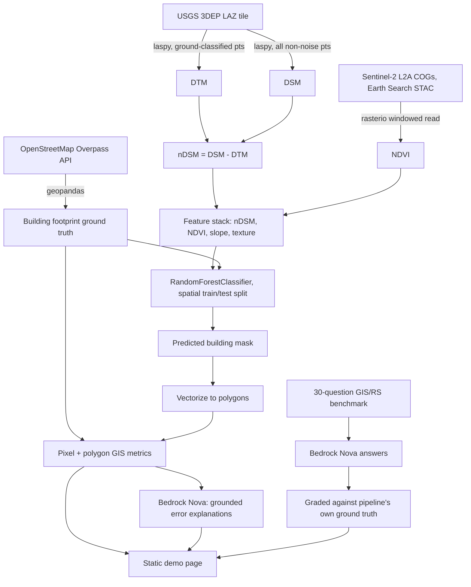

# GeoAI Building Intelligence

LiDAR + Sentinel-2 + OpenStreetMap building extraction pipeline over Washington, DC, with a Bedrock Amazon Nova GIS/remote-sensing knowledge benchmark built on top of it.

**Live demo:** https://www.forwardforecasting.eu/gis-lidar/
**Write-up:** https://education.forwardforecasting.eu/gis-lidar/

This project fuses a real USGS 3DEP LiDAR point cloud with a real Sentinel-2 optical scene to extract building footprints, validates the result against real OpenStreetMap building polygons at both the pixel and polygon level, and then uses AWS Bedrock's Amazon Nova Lite for two things: explaining specific model errors from their actual measured feature values, and answering a 30-question GIS/remote-sensing benchmark that gets graded against the pipeline's own ground truth where possible.

## Table of contents

- [Why this exists](#why-this-exists)
- [Data flow](#data-flow)
- [Data sources](#data-sources)
- [Methodology](#methodology)
- [Why RandomForest, not a CNN](#why-randomforest-not-a-cnn)
- [Results](#results)
- [The AI layer](#the-ai-layer)
- [Limitations and what a production version would need](#limitations-and-what-a-production-version-would-need)
- [Repository layout](#repository-layout)
- [Running it yourself](#running-it-yourself)
- [AWS / Bedrock cost](#aws--bedrock-cost)

## Why this exists

This is a demonstrator built in response to a recruiter outreach for a remote GIS/Remote Sensing freelance role focused on evaluating and improving AI models on domain-specific geospatial expertise. Rather than run NDVI on a Sentinel-2 tile and call it a day, the goal was to show the full geospatial ML lifecycle end to end: real raster and vector data in their native, awkward forms, real coordinate reference systems that don't quite line up, real multimodal fusion, real GIS-aware evaluation (not just pixel accuracy), and a genuine attempt at the specific skill the role is screening for: evaluating whether an AI's answer about GIS/remote-sensing concepts is actually correct.

## Data flow



## Data sources

The original project brief (from a colleague's proposal) recommended SpaceNet 6 (SAR+optical, Rotterdam) and Spain's PNOA LiDAR programme (via IGN/CNIG). Both were evaluated and dropped for practical reasons, documented honestly rather than silently swapped:

- **SpaceNet 6** is distributed as a multi-gigabyte AWS Open Data collection intended for full model-training pipelines; too large to responsibly pull for a demonstrator like this.
- **PNOA LiDAR** is real and free, but distributed through IGN's `centrodedescargas.cnig.es` portal, which is session/form-based rather than a stable scriptable endpoint, which makes it a poor fit for a reproducible pipeline (though a strong candidate for a follow-up, see Limitations).

Instead, this project uses three sources that are all genuinely free, require no account or API key, and are directly scriptable:

| Source | What | Access |
|---|---|---|
| **USGS 3DEP** | LiDAR point cloud, tile `18SUJ325305`, Sandy Supplemental NCR VA/MD/DC QL2 LiDAR project (flown 2014) | Public HTTPS, found via the [TNM Access API](https://tnmaccess.nationalmap.gov/api/v1/products), no auth |
| **Sentinel-2 L2A** | Scene `S2A_18SUJ_20260531_0_L2A`, 0.003% cloud cover | [Element84 Earth Search STAC API](https://earth-search.aws.element84.com/v1/search) + public COGs on S3, no auth |
| **OpenStreetMap** | 3,098 building footprints in the source bbox, 74 in the held-out test region | [Overpass API](https://overpass-api.de/api/interpreter), single query, no auth |

**AOI:** a ~700m x 650m block of Capitol Hill, Washington, DC (38.882-38.888N, -77.005 to -76.998W), a dense rowhouse neighborhood chosen specifically because it stresses the polygon-level evaluation: rowhouses share party walls, which turns out to matter a lot (see Results).

## Methodology

1. **DTM/DSM/nDSM from LiDAR.** The LAZ tile's classification field is used to separate ground returns (class 2) from everything else. Ground points are gridded to a DTM at 2m resolution (per-cell minimum elevation, gap-filled by nearest-neighbor interpolation, lightly smoothed). All non-noise points (a plain elevation sanity clip, since this particular tile's vendor loosely reused ASPRS class 17 for a large fraction of points well beyond actual bridge decks) are gridded to a DSM (per-cell maximum). `nDSM = DSM - DTM` gives building/canopy height above bare earth directly, no ML needed for that part, just the physics of the point cloud.
2. **NDVI from Sentinel-2.** Red (B04) and NIR (B08) bands are read as a windowed request directly against the public COGs (no full-scene download) and resampled onto the same 2m grid as the LiDAR products. Sentinel-2's native resolution for these bands is 10m, which is visibly blockier than the LiDAR-derived layers once resampled down to 2m, an honest illustration of the spatial-resolution tradeoff between the two sensor types.
3. **Feature stack.** Four features per grid cell: nDSM, NDVI, terrain slope (Sobel gradient of the DTM), and a local texture feature (standard deviation of nDSM in a 3x3 window, since building edges and roof structure create more local variance than flat ground or uniform canopy).
4. **Spatial train/test split.** The rightmost 25% of the grid (a contiguous geographic block) is held out entirely for testing; the remaining 75% is used for training. A random pixel split was deliberately avoided: neighboring pixels are spatially autocorrelated, so a random split would leak test information into training and overstate accuracy, a common and easy-to-miss mistake in raster ML that a spatial holdout avoids.
5. **Classifier.** `sklearn.ensemble.RandomForestClassifier` (300 trees, class-balanced) trained on the four features against the OSM building mask as labels.
6. **Two naive baselines**, evaluated on the exact same held-out region, to make the multimodal-fusion case with real numbers instead of an assertion: an NDVI-only threshold and an nDSM-only threshold.
7. **Pixel and polygon evaluation.** Pixel-level precision/recall/F1/IoU, plus vectorizing the predicted mask into polygons (`rasterio.features.shapes`) and matching them against individual OSM building polygons (IoU >= 0.3 threshold) for building-level detection rate, mean matched-polygon IoU, mean area error, and mean centroid displacement.

## Why RandomForest, not a CNN

A CNN (U-Net/SegFormer style) is the right tool for large-scale building extraction across many tiles with enough labeled data to actually benefit from learned spatial filters. For this project's actual constraints, it would be the wrong default:

- Four physically meaningful, already-engineered features per pixel is a tabular problem, not an image problem; a CNN's main advantage (learning spatial filters from raw pixels) isn't needed when the features already encode "is this raised off the ground" and "is this vegetation" directly.
- The AOI is ~100k pixels. A CNN needs far more labeled examples (or heavy data augmentation and transfer learning) to avoid overfitting at this scale; a RandomForest with 5 min-samples-per-leaf is well matched to it.
- It trains in a few seconds on a laptop CPU, no GPU, no training-infrastructure story to build for a demonstrator.
- Feature importances are directly interpretable (see Results), which matters for a project whose whole point is explaining *why* a model got something right or wrong, not just optimizing a metric.

The honest tradeoff: a CNN would likely generalize better across cities/sensors/nDSM noise it hasn't seen and would learn spatial relationships (like "adjacent rowhouses often split at a subtle roofline seam") that hand-engineered per-pixel features cannot capture, which is exactly why this project's biggest single limitation (rowhouse under-segmentation, below) is a spatial-context problem a CNN is structurally better positioned to solve.

## Results

### Pixel-level, held-out test region

| Model | Precision | Recall | F1 | IoU |
|---|---|---|---|---|
| NDVI-only baseline (low NDVI -> building) | 77.3% | 43.7% | 55.8% | 38.7% |
| nDSM-only baseline (height > 2.5m -> building) | 35.7% | 99.7% | 52.5% | 35.6% |
| **RandomForest, nDSM + NDVI + slope + texture** | **79.3%** | **80.2%** | **79.7%** | **66.3%** |

NDVI-only is precise (low NDVI mostly does mean "not vegetation") but misses more than half of all buildings, because roads, parking lots, and bare soil also read as "not vegetation." nDSM-only catches almost every building (99.7% recall) but drags in nearly every tree along the way, cratering precision to 35.7%. Only the fused model gets both right at once, which is the entire point of combining a height sensor with a spectral sensor.

### Polygon-level, held-out test region

| Metric | Value |
|---|---|
| Ground-truth OSM buildings | 74 |
| Predicted building polygons | 72 |
| Matched at IoU >= 0.3 | 33 |
| **Building-level detection rate** | **44.6%** |
| Mean matched-polygon IoU | 0.61 |
| Mean building area error | 36.1% |
| Mean centroid displacement | 6.5 m |

This is the number the pixel metrics hide, and it's not a bug: Capitol Hill rowhouses share party walls, so a block of 3-4 attached units presents one continuous rooftop in the nDSM with no height discontinuity between neighbors. The classifier correctly labels the whole roofline as "building" at the pixel level (which is why pixel F1 is a healthy 79.7%), but the polygon vectorizer then merges those attached units into a single predicted polygon, which counts as one match against several ground-truth parcels. This under-segmentation is exactly the kind of failure mode that pixel accuracy alone would hide and that a GIS reviewer evaluating "did we actually find each building" would immediately flag, which is precisely why the project reports both.

### Feature importances

| Feature | Importance |
|---|---|
| NDVI | 45.2% |
| nDSM | 39.8% |
| Texture (local nDSM std) | 11.8% |
| Slope | 3.2% |

NDVI edges out nDSM slightly: in this densely tree-lined neighborhood, "not vegetation" turns out to be almost as discriminative as "raised off the ground," because so much of the non-building raised terrain is actually street tree canopy.

## The AI layer

Two uses of AWS Bedrock's **Amazon Nova Lite**, via the `eu-west-1` cross-region inference profile (`eu.amazon.nova-lite-v1:0`; a plain `us-east-1`/on-demand model ID is not invokable for Nova on this account, only the cross-region inference profile is):

1. **Grounded error explanations.** Three real misclassifications from the held-out test set (two false negatives, one false positive) are passed to Nova with their actual measured nDSM/NDVI/slope values, and it generates a plausible domain explanation for each, grounded in those numbers rather than a generic response. See the live demo for the full text.
2. **A 30-question GIS/remote-sensing benchmark**, covering CRS/projections, raster vs vector, GeoTIFF/COG, NDVI, SAR vs optical, DSM/DTM/DEM/nDSM, orthorectification, photogrammetry, spatial/temporal/spectral resolution, segmentation vs detection, spatial joins, topology, and spatial indexing. Nova's answers are shown in full on the demo page; for the questions this pipeline has direct ground truth for (DSM/DTM/nDSM, LiDAR return behavior), the answers are graded rather than taken at face value. One answer was flagged as imprecise: Nova claimed "last-returns are essential for accurately modeling building surfaces," which overstates it, buildings are opaque, single-return surfaces, so first return equals last return there; the first/last-return distinction that actually matters is for vegetation, not buildings. This is a small but real example of the exact skill the underlying freelance role is about: not taking an AI's plausible-sounding domain answer at face value.

## Limitations and what a production version would need

- **A 2014 LiDAR flight against present-day OSM footprints.** Capitol Hill is a historic district with little redevelopment, and a sanity check in this repo confirms 99.4% of OSM building pixels have nDSM > 2.5m (i.e. the two datasets still line up spatially), but a production system would need a current LiDAR acquisition or an explicit change-detection step to flag areas where they might not.
- **Rowhouse under-segmentation** (see Results) is the single biggest gap. A production version would need either a CNN with enough spatial context to learn subtle roofline seams, or a post-processing step using cadastral parcel boundaries to split merged polygons.
- **One AOI, one city.** Feature thresholds and importances here are specific to a dense, tree-heavy mid-Atlantic US neighborhood; a production model would need multi-city training data to generalize.
- **PNOA LiDAR and SpaceNet 6 were not used**, for the practical reasons in Data Sources. A production system targeting Spain specifically would still want PNOA (through IGN's bulk WMS/WCS services rather than the interactive download portal) for national coverage, and SpaceNet 6 remains the right choice if SAR is a hard requirement (e.g. all-weather monitoring), since none of this project's sources include SAR.
- **No live serving.** The classifier, LLM calls, and evaluation all run once at build time; the deployed page is a static artifact. A production version serving new AOIs on demand would need a real backend, not a baked static page.

## Repository layout

```
gis-lidar/
  src/
    ingestion/       # LiDAR tile fetch (TNM API + HTTPS), Sentinel-2 STAC search, OSM Overpass fetch
    preprocessing/    # DTM/DSM/nDSM, NDVI grid, OSM rasterization, shared analysis grid
    features/         # feature stack builder (nDSM, NDVI, slope, texture)
    models/           # RandomForest classifier, naive baselines, visualization
    evaluation/        # pixel metrics, polygon vectorization + polygon metrics
    llm/               # Bedrock Nova benchmark + error-explanation calls
  scripts/
    run_pipeline.py         # end-to-end: features -> train -> evaluate -> metrics.json
    build_static_demo.py    # renders static/index.html from the processed artifacts
  data/
    raw/          # downloaded LAZ / OSM JSON (gitignored, re-fetched by ingestion scripts)
    processed/    # small derived artifacts committed to the repo (rasters, metrics, benchmark answers)
  static/
    index.html    # the live demo page, synced to forwardforecasting-landing on push
  tests/          # fast unit tests on synthetic arrays, no network required
  data/benchmark_questions.json   # the 30 GIS/RS benchmark questions
```

## Running it yourself

```bash
python3 -m venv .venv && source .venv/bin/activate
pip install -r requirements.txt

# Re-fetch and rebuild everything (LiDAR tile ~60MB, no credentials needed)
python3 src/ingestion/osm_buildings.py
python3 -c "from src.preprocessing.dtm_dsm import build_dtm_dsm; import numpy as np; dtm,dsm,ndsm,t,s = build_dtm_dsm('data/raw/lidar/tile_18SUJ325305.laz'); [np.save(f'data/processed/{n}.npy', a) for n,a in [('dtm',dtm),('dsm',dsm),('ndsm',ndsm)]]"
python3 scripts/run_pipeline.py

# Requires AWS credentials with Bedrock access in eu-west-1 for the LLM layer
python3 scripts/build_static_demo.py

pytest tests/ -q
ruff check src/ tests/ scripts/
```

## AWS / Bedrock cost

Effectively **$0**. LiDAR and Sentinel-2 reads are all against public, no-sign-request S3 buckets and free public APIs (TNM, Earth Search STAC, Overpass); nothing here uses a paid AWS data-egress path. The only billed AWS usage is ~33 short Amazon Nova Lite invocations (30 benchmark questions + 3 error explanations), roughly 1,900 input tokens and 2,300 output tokens combined, which on Nova Lite's per-1K-token pricing comes to a fraction of a cent total. No persistent AWS infrastructure runs for this project; the live demo is a static HTML page served by existing infrastructure already running for other projects on this account.
